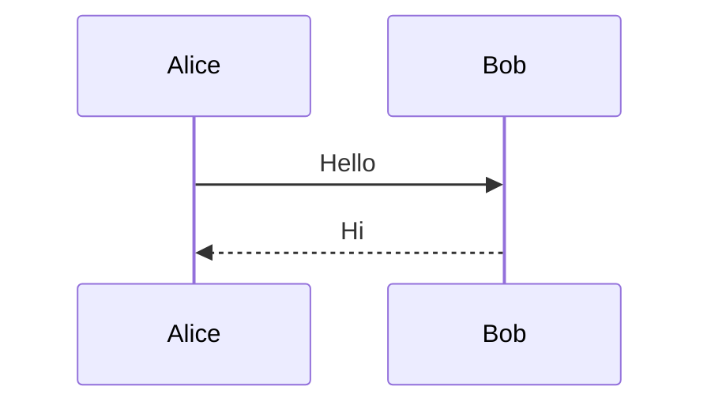

# Mermaid Blocks в Gramax

Mermaid поддерживается двумя путями в зависимости от `syntax` в `.doc-root.yaml`.

## XML syntax

```xml
<mermaid>
flowchart TD
  A[Start] --> B{Decision}
  B -->|yes| C[Action]
  B -->|no| D[End]
</mermaid>
```

Требования:
- Тег `<mermaid>...</mermaid>` без атрибутов.
- Содержимое — чистый mermaid (без bbcode-обёрток).
- Пустые строки до и после тега обязательны (иначе Gramax-парсер может пропустить блок).

## Markdown syntax

````markdown

````

Требования:
- Fenced block с языком `mermaid`.
- Пустые строки до и после fenced-блока.

## Поддерживаемые типы диаграмм

В Gramax работают (по состоянию на 2026-05):
- `flowchart` (TD/LR/BT/RL)
- `sequenceDiagram`
- `gantt`
- `classDiagram`
- `stateDiagram-v2`
- `erDiagram`
- `pie`
- `mindmap`

Не поддерживаются: `gitGraph`, `journey`, `requirementDiagram`, `C4Context` (рендер падает или скрывается).

## Типичные ошибки

| Проблема | Причина | Фикс |
|----------|---------|------|
| Блок не рендерится | Нет пустой строки до/после | Добавить пустые строки |
| Кириллица в node-label "плывёт" | Нет кавычек | Оборачивай: `A["Старт"]` |
| `--->` рендерится как текст | Mermaid не поддерживает | Используй `-->` или `-.->` |
| Несколько диаграмм слиплись | Один общий блок | Разбей на отдельные `<mermaid>` |

## Примеры

Дополнительные примеры — в реальных Gramax-каталогах с mermaid-блоками.
