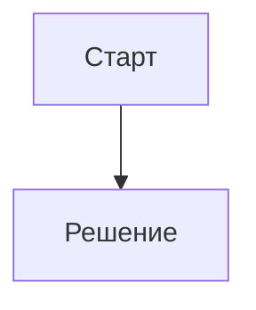

# Mermaid для Gramax

Skill переводит текстовое описание в корректный mermaid DSL и вставляет результат в Gramax-страницу. Работает inline — без MCP, без скриптов, без preview. Генерация DSL встроена в этот skill; правила синтаксиса предотвращают типовые ошибки парсера.

Адаптировано из [axtonliu/axton-obsidian-visual-skills](https://github.com/axtonliu/axton-obsidian-visual-skills) (MIT). Полный текст лицензии и список изменений — в [`LICENSE.upstream.md`](LICENSE.upstream.md).

## When to use

- Пользователь просит визуализировать процесс, архитектуру, цикл, сравнение, иерархию.
- Нужно flowchart / sequence / gantt / class / state / ER / pie / mindmap.
- Вставить mermaid-диаграмму в md-файл Gramax-каталога.

**Не для:** drawio-диаграмм (для drawio используй внешний плагин **drawio** из marketplace **Agents365-ai/365-skills**), preview диаграмм в браузере, рендера в SVG/PNG.

## Quick start

1. Прочитай запрос пользователя — выдели сущности, отношения, последовательность.
2. Выбери тип диаграммы (см. ниже). По умолчанию — flowchart TB.
3. Определи Gramax-синтаксис каталога — открой ближайший `.doc-root.yaml` (обход вверх от target_page), поле `syntax: XML` или `syntax: Markdown`. Если файла нет — используй Markdown с предупреждением.
4. Сгенерируй DSL по правилам ниже.
5. Вставь блок в md-файл в нужном синтаксисе:
   - **XML:** `<mermaid>...</mermaid>` (с пустыми строками до/после)
   - **Markdown:** fenced block ` ```mermaid ... ``` ` (с пустыми строками до/после)

## Поддерживаемые типы (Gramax)

| Тип | Подходит для |
|-----|--------------|
| `flowchart TB/LR` | Процессы, workflows, decision tree, AI-агенты |
| `sequenceDiagram` | Взаимодействия, API-вызовы, message flow |
| `gantt` | Планы, расписания, timeline |
| `classDiagram` | UML классы, доменные модели |
| `stateDiagram-v2` | Состояния, lifecycle, переходы |
| `erDiagram` | Сущности БД, отношения, схемы |
| `pie` | Доли, распределение, проценты |
| `mindmap` | Иерархия концепций, разбор темы |

**НЕ поддерживаются в Gramax:** `gitGraph`, `journey`, `requirementDiagram`, `C4Context` — рендер падает. При запросе таких типов сообщи пользователю и предложи замену (например, `C4Context` → `flowchart TB` с подграфами).

## Критические правила синтаксиса

### 1. Конфликт с list-syntax (самая частая ошибка)

Парсер mermaid читает `1. Текст` как Markdown-список и падает с `Unsupported markdown: list`.

```
❌ A[1. Анализ]
✅ A[1.Анализ]                # без пробела
✅ A[① Анализ]                # circled-numbers ① ② ③ ④ ⑤ ⑥ ⑦ ⑧ ⑨ ⑩
✅ A[(1) Анализ]              # скобки
✅ A[Шаг 1: Анализ]           # префикс
✅ A[Анализ]                  # без нумерации
```

### 2. Subgraph с пробелами

```
❌ subgraph Core Process
✅ subgraph core["Core Process"]    # ID + display name
✅ subgraph core_process            # просто ID без пробелов
```

### 3. Ссылки на ноды — только по ID

```
A[Display Text A]
B["Display Text B"]

✅ A --> B                          # по ID
❌ Display Text A --> Display Text B
```

### 4. Спецсимволы в тексте ноды

- Пробелы → оборачивай в кавычки: `A["Текст с пробелами"]`
- Кавычки внутри → заменяй на `『』`
- Скобки внутри → заменяй на `「」`
- Переносы строки `<br/>` работают только в круглых нодах: `((Текст<br/>Перенос))`
- Кириллица — оборачивай в кавычки: `A["Старт"]`

### 5. Стрелки

- `-->` сплошная
- `-.->` пунктирная (опциональные пути, обратная связь)
- `==>` жирная (акцент)
- `~~~` невидимая (только для лейаута)
- `<-->` двунаправленная

Полный справочник синтаксиса, troubleshooting и edge cases — в [`references/syntax-rules.md`](references/syntax-rules.md).

## Конфигурация (опции для пользователя)

**Направление:**
- `TB`/`TD` (top→bottom, default), `BT`, `LR` (left→right, для timeline), `RL`

**Уровень детализации:**
- `simple` — только ключевые ноды
- `standard` — баланс деталей и читаемости (default)
- `detailed` — полные аннотации
- `presentation` — для слайдов: крупный текст, меньше нод

**Стиль:**
- `minimal` — монохром
- `professional` — семантические цвета, иерархия (default)
- `colorful` — яркие цвета, высокий контраст
- `academic` — формальный для документации

## Палитра (professional default)

| Семантика | Fill | Stroke |
|-----------|------|--------|
| Старт, ввод, восприятие | `#d3f9d8` | `#2f9e44` |
| Решение, риск | `#ffe3e3` | `#c92a2a` |
| Обработка, рассуждение | `#e5dbff` | `#5f3dc4` |
| Действие, инструмент | `#ffe8cc` | `#d9480f` |
| Вывод, результат | `#c5f6fa` | `#0c8599` |
| Память, данные | `#fff4e6` | `#e67700` |
| Обучение | `#f3d9fa` | `#862e9c` |
| Заголовок, мета | `#e7f5ff` | `#1971c2` |
| Нейтрал | `#f8f9fa` | `#868e96` |

Применение:
```
style A fill:#d3f9d8,stroke:#2f9e44,stroke-width:2px
```

## Типовые паттерны

### Swimlanes (группировка)

```
flowchart TB
    subgraph core["Основной процесс"]
        A --> B --> C
    end
    subgraph support["Вспомогательные системы"]
        D
        E
    end
    core -.-> support
```

### Цикл с обратной связью

```
flowchart TB
    A[Старт] --> B[Обработка]
    B --> C[Результат]
    C -.->|Обратная связь| A
```

### Hub-and-spoke

```
flowchart TB
    Hub[Центр]
    A[Узел 1] --> Hub
    B[Узел 2] --> Hub
    C[Узел 3] --> Hub
```

## Workflow генерации

1. **Понять контент** — сущности, иерархия, последовательность, контрасты.
2. **Выбрать тип** — flowchart по умолчанию, если неоднозначно.
3. **Применить конфиг** — параметры из запроса + sensible defaults.
4. **Сгенерировать DSL** — соблюдая 5 критических правил.
5. **Самопроверка** (см. checklist ниже).
6. **Определить Gramax-syntax** — открой `.doc-root.yaml` (XML vs Markdown).
7. **Вставить в md** — с пустыми строками до и после блока.

## Checklist перед вставкой

- [ ] Нет паттерна `число. пробел` в тексте нод
- [ ] Subgraph с пробелами в имени → ID+display
- [ ] Все ссылки на ноды — по ID, не по display-тексту
- [ ] Стрелки — валидный синтаксис (`-->`, `-.->`, `==>`)
- [ ] Тип входит в 8 поддерживаемых Gramax (или предупреждение пользователю)
- [ ] Кириллица в node-label обёрнута в кавычки: `A["Старт"]`
- [ ] Пустые строки до и после блока в md
- [ ] **Без emoji** в тексте нод — используй цвет или текст вместо
- [ ] Стили задекларированы консистентно

## Gramax-интеграция

Если пользователь указал `target_page` (md-файл) — вставь блок в нужном месте. Синтаксис:

**XML (`.doc-root.yaml` → `syntax: XML`):**

```xml
<mermaid>
flowchart TB
  A["Старт"] --> B["Решение"]
</mermaid>
```

**Markdown (`.doc-root.yaml` → `syntax: Markdown` или отсутствует):**

````markdown

````

Mermaid рендерится Gramax-фронтендом при отображении страницы — отдельный файл не нужен. Если требуется drawio-диаграмма с сохранением `.svg` рядом со страницей — используй внешний плагин **drawio** из marketplace **Agents365-ai/365-skills**.

## References

- [`references/syntax-rules.md`](references/syntax-rules.md) — полный справочник синтаксиса, troubleshooting, advanced patterns.
- [`LICENSE.upstream.md`](LICENSE.upstream.md) — MIT-лицензия upstream-источника и список изменений.
