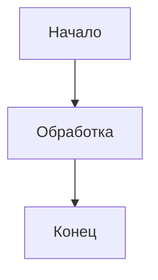

# Пример устаревшего inline mermaid (fenced)

Текст статьи перед диаграммой — намеренно короткий, фикстура проверяет только формат блока,
не его смысл.

```mermaid
flowchart TB
    A[Начало] --> B[Обработка]
    B --> C[Конец]
```

Текст статьи после диаграммы.
