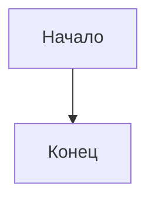
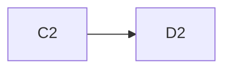

Первый блок — fenced:

```mermaid
flowchart TB
    A1[Начало] --> B1[Конец]
```

Второй блок — paired:

<mermaid>
sequenceDiagram
    A->>B: Запрос
    B-->>A: Ответ
</mermaid>

Третий блок — снова fenced:

```mermaid
flowchart LR
    C2 --> D2
```
